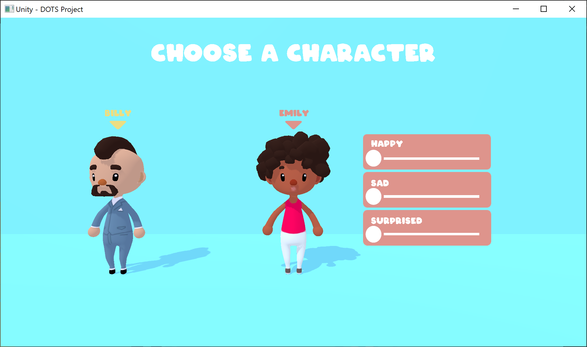
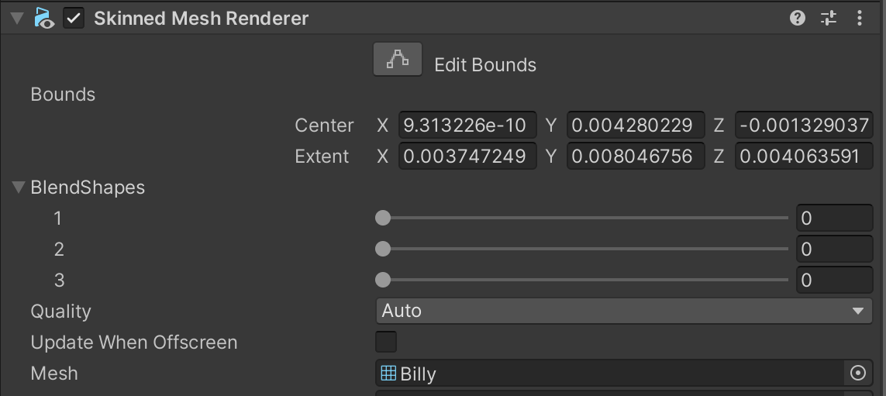
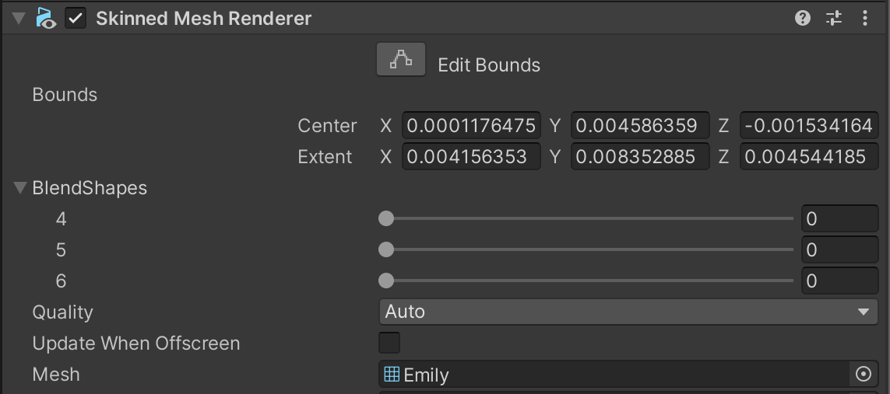
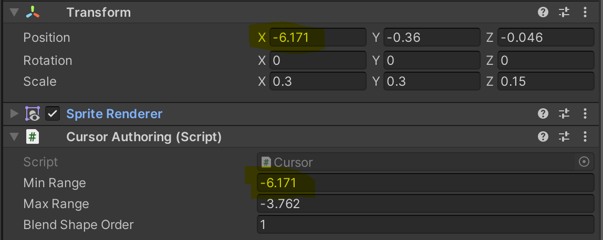

# About BlendShape demo
This project demonstrates how to use the blendShape feature and showcases how to do a simple character selection.



**How to use**

Select a character by clicking on it, the camera will translate to face the character selected and a small interface will appear allowing to customize the character.
You can choose between two characters: Billy and Emily. Both have specific elements to customize. When the user decides to customize Billy, they will be able to change simple elements from the face, such as the eyes, the nose and the mouth. On the other hand, when the user decides to customize Emily, they will be able to change many elements at the same time using emotions : happy, sad and surprised. All customization works with custom sliders. This method allows the user to blend between several parts of the face.

# Project Structure

## State machine

This demo uses a state machine pattern to control the application flow. All states are listed in the form of an enum. When the user starts the project, the game state will be set as Idle. However, when a character is selected, the game state value will change to _Moving u_ntil it has reached its destination (Billy or Emily).

_File : Game.cs_
```cs
namespace BlendShapeDemo 
{
    public enum GameState 
    {
        Idle,
        Moving,
        Billy,
        Emily   
    }

    [GenerateAuthoringComponent]
    public struct Game : IComponentData
    {
        public GameState gameState;
    }
}
```

## UI

This sample does not use Tiny UI, insteat is uses an empty gameObject using a sprite renderer as a component. 
Each specific element is only visible according to the game state. To do so, we simply verify if the UI corresponds to the game state.

_File : ShowPanelSystem.cs_
```cs
namespace BlendShapeDemo
{
    /// <summary>
    /// Show panel according to game state
    /// </summary>
    [UpdateAfter(typeof(TransformSystemGroup))]
    public class ShowPanelSystem : SystemBase
    {
        protected override void OnUpdate()
        {
            var game = GetSingleton<Game>();

            Entities.WithEntityQueryOptions(EntityQueryOptions.IncludeDisabled).ForEach((Entity entity, ref Panel panel) =>
            {
                EntityManager.SetEnabled(entity, panel.gameState == game.gameState);

            }).WithStructuralChanges().Run();
        }
    }
}
```

## Input

For consistency, we used the exact same input system used in the Unity Tiny PhysicsDemo. However, we changed some elements to be able to drag the cursor on the slider according to the mouse position. Actually, we created another script allowing us to get the exact mouse position in the _X axis_ according to the camera position.

_File : ScreenToWorldSystem.cs_
```cs
namespace BlendShapeDemo 
{
    /// <summary>
    /// Convert screen point to world point
    /// </summary>

    public static class ScreenToWorldSystem
    {
        // Camera distance
        private const float nearClip = 6.5f;

        public static float3 ScreenPointToWorldPoint(World world, float screenPoint)
        {
            var screenToWorldSystem = world.GetExistingSystem<ScreenToWorld>();
            var worldPoint = screenToWorldSystem.ScreenSpaceToWorldSpacePos(screenPoint, nearClip);
            return worldPoint;
        }
    }
}
```

## Sliders

**Cursor**

Each slider is composed of a simple bar (empty gameObject with a SpriteRenderer as component) and a cursor (another empty gameObject with a SpriteRenderer as component). 

A custom component script composed of two float variables used as the range limit (minimum and maximum value) of the cursor is added to each cursor. Also, each blendShape of the characters are listed in the form of an enum.

_File : Cursor.cs_
```cd
namespace BlendShapeDemo
{
    [GenerateAuthoringComponent]
    public struct Cursor : IComponentData
    {
        public float minRange;
        public float maxRange;
        public int blendShapeOrder;
    }
}
```





The minRange and maxRange values corresponds to the cursor position



**Remap slider value**

A public float method is created in the _BlendShapeSystem.cs _to be able to normalize the value between a range of 0 and 100. This method gets in parameters the _minRange _and _maxRange _variables from the cursor component attached to the cursor selected and remaps them to be able to have a specific number to modify the BlendShape weight value.

_File : BlendShapeSystem.cs_
```cs
        // Remap slider value to fit with the BlendShape weight (0, 100)
        public float RemapSlider(float rawMin, float rawMax, float newMin, float newMax, float rawValue)
        {
            float rawRange = (rawMax - rawMin);
            float newRange = (newMax - newMin);
            float newCurrentValue = (((rawValue - rawMin) * newRange) / rawRange) + newMin;

            return newCurrentValue;       
        }
```


<strong>Move the cursor according to the mouse position in the X axis</strong>

In order to move the cursor with the mouse position, we need to get access to the method that we demonstrated earlier (ScreenPointToWorldPoint) in the input section. This method will return a float and that value is the mouse position in the X axis in our context.

Then, we verify if a cursor is pressed or not. If it is, we set his translate position value (in the X axis) at the same as the mouse position (in the X axis). Also, we verify if the cursor position value is between his range. The minRange and maxRange variables are used to set a limit at the cursor's position.

_File : BlendShapeSystem.cs_
```cs
        private InputSystem inputsystem;

        protected override void OnCreate()
        {
            inputsystem = World.GetExistingSystem<InputSystem>();
        }

        protected override void OnUpdate()
        {
            var game = GetSingleton<Game>();
            var input = World.GetExistingSystem<InputSystem>();
            var inputPos = inputsystem.GetInputPosition();
            var mousePos = ScreenToWorldSystem.ScreenPointToWorldPoint(World, inputPos.x);

            if (game.gameState == GameState.Billy || game.gameState == GameState.Emily) 
            {
                Entities.ForEach((ref Entity entity, ref Cursor cursor, ref Tappable tappable, ref Translation translation) =>
                {                   
                    if (tappable.IsPressed) 
                    {
                        // Check if the current cursor is between the right range
                        if (translation.Value.x >= cursor.minRange && translation.Value.x <= cursor.maxRange) 
                        {
                            translation.Value.x = mousePos.x;                          
                            SetBlendShape(cursor.blendShapeOrder.ToString(), RemapSlider(cursor.minRange, cursor.maxRange, 0, 100, translation.Value.x));                         
                        }  
                        
                        // Clamp min slider
                        if(translation.Value.x <= cursor.minRange) 
                            translation.Value.x = cursor.minRange;

                        // Clamp max slider
                        if (translation.Value.x >= cursor.maxRange) 
                            translation.Value.x = cursor.maxRange;
                    }                       
                }).WithStructuralChanges().Run();          
            }
        }
```


**BlendShape with sliders**

Now that the cursors move according to the mouse position and that we can remap the slider value by a range of 0 and 100. We can simply set the weight value of the blendShape selected to the current cursor position value. To do so, we create another method that takes the blendShapeName (enum value of the cursor) and his position value remapped in parameters. That method is called every time a cursor is pressed and moved.

_File : BlendShapeSystem.cs_
```cs
        // Select the BlendShape we want and modify his weight according to the slider value
        public void SetBlendShape(string blendShapeName, float blendShapeWeight)
        {
            #if UNITY_DOTSRUNTIME

                EntityCommandBuffer ecb = new EntityCommandBuffer(Allocator.Temp);

                Entities.ForEach((Entity entity, DynamicBuffer<BlendShapeWeight> smrBlendShapeWeightBuffer, ref SkinnedMeshRenderer smr, ref Character character) =>
                {
                    SetBlendShapeWeight setWeight = new SetBlendShapeWeight();
                 
                    setWeight.NameHash = BlendShapeChannel.GetNameHash(blendShapeName);
                    setWeight.ModifiedWeight = blendShapeWeight;
                    DynamicBuffer<SetBlendShapeWeight> setWeightsBuffer = ecb.AddBuffer<SetBlendShapeWeight>(entity);
                    setWeightsBuffer.Add(setWeight);
                }).WithoutBurst().Run();

                ecb.Playback(EntityManager);
                ecb.Dispose();

            #endif
        }
```
