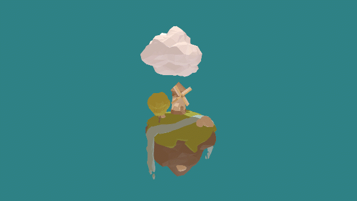
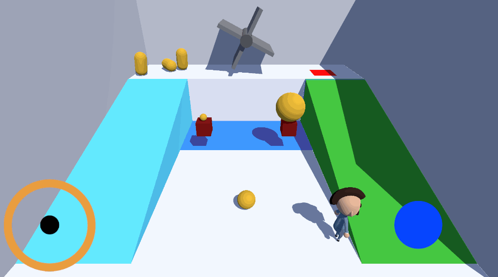
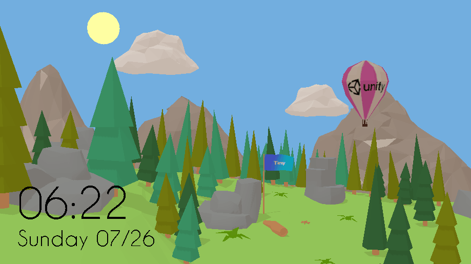
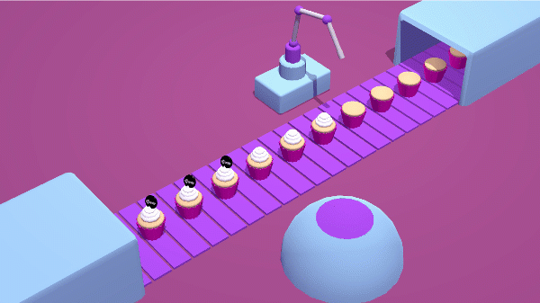
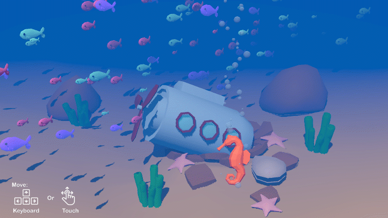
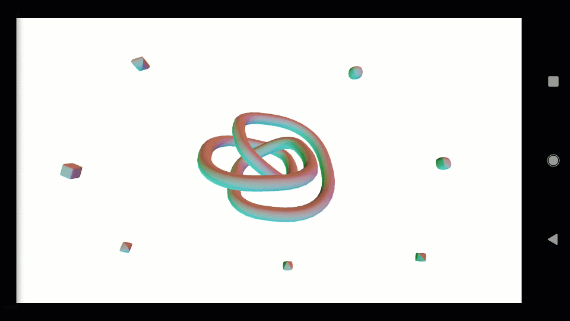

# Project Tiny Samples
This repository contains samples for Project Tiny.
Please [read through the Project Tiny guide](https://docs.google.com/document/d/1A8hen2hLFY5FLkC5gd3JP2Z-IpHfnAX-CpYLK3aOdwA/edit?usp=sharing) to understand the current project state, limitations, and getting started information.

Current samples:
## Tiny3D
A "Hello World" style sample with minimal assets & code. It's a great starting point for a new "clean" project.

 
    

 
    

## TinyRacing
Intended as a lightweight example of the type of content you can build with Project Tiny. It is a complete game slice showing a number of elements such as accepting input, implementing simple AI, handling collisions, and similar. Please explore and play around with the sample project to get a feel for what developing with pure DOTS looks like.

 
    

 
    

## TinyKitchen
Uses physics to showcase simple game play with colorful level design and advanced authoring workflow. In addition to that Tiny Kitchen uses custom web template.

 
    

 
    

## TinyPhysics
Illustrates how to combine simple Unity Physics behaviors and common input methods (keyboard, touch, mouse).

 
    

 
    

## TinyTime
Demonstrates how to use in-game text rendering, Skinned mesh renderer and how to dynamically chagne the scene lighting.

 
    

 
    

## TinyFactory
Demonstrates how Animations can be added to a scene (no code).

 
    

 
    

## TinyAquarium 
Demonstrates Particle System the first iteration of the particle system which mirrors a subset of the functionalities available with the built-in Particle System (aka shuriken).

 
    

 
    

## RuntimeGeometry3D
Demonstrates how to do Dynamic meshes creation at runtime. 

 
    

 
    

## TinyGems and TinySpaceship
2D sample projects that showcases some of the features that can be found inside the 2D Entities package.

 
    

 
    

 
    

 
    

