# Project Tiny Physics and Inputs Samples Tutorial

## Before you start

This tutorial assumes that you have read the [Getting Started
guide](https://docs.google.com/document/d/1A8hen2hLFY5FLkC5gd3JP2Z-IpHfnAX-CpYLK3aOdwA/edit)
(in particular the [Anatomy of a Tiny
Project](https://docs.google.com/document/d/1A8hen2hLFY5FLkC5gd3JP2Z-IpHfnAX-CpYLK3aOdwA/edit#heading=h.g2tpgc2e6s52)),
and successfully installed and run at least one of the [Project Tiny
Samples](https://github.com/Unity-Technologies/ProjectTinySamples). We recommend
you try explore, build & run Tiny3D which is the simplest project.

The goal of this tutorial is to illustrate how to combine simple Unity Physics
behaviors and common touch input methods.

**It’s important to note that this project will not work properly in Play mode / Ctrl-P**, see
[Play-in-Editor](https://docs.google.com/document/d/1A8hen2hLFY5FLkC5gd3JP2Z-IpHfnAX-CpYLK3aOdwA/edit#heading=h.k8ptza9g0cry)
in Getting Started for details on why.

You need to use a Build Configuration with the Build and Run option: 


We recommend you use the Windows-DotNet configuration for fastest iteration: 

**Tip**: you can add inspectors, lock them to your favorite Build Configurations
and dock them in a corner of the editor:  


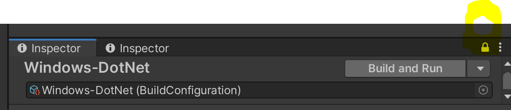

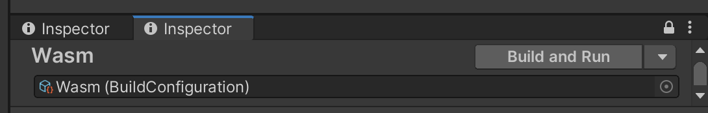

The project has one “host” scene “TinyPhysics” with a subscene component where
we will be swapping subscenes as you progress through the steps adding features.

TinyPhysics scene will look like this, with “1. Hello World” as a starting
point:

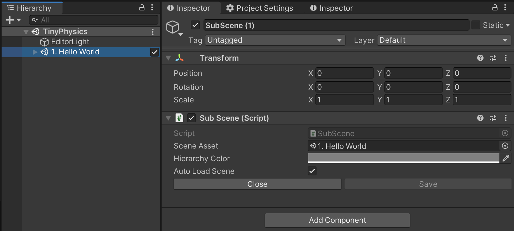

For each scene in the tutorial we describe the main steps to build the scene.  
However we **focus only on the important aspects** to consider and have omitted
some steps to complete the scene. But you’ll find a corresponding completed
scene in the project for you to explore to see the end result.

## 1. Hello World

The goal is to create a simple playground with some objects that can be used
with the physics engine.

The “1. Hello Word” in the project is ready to run.

We used the following steps to create it:

-   Create a scene, delete everything from it and add a gameobject with a
    SubScene component. This is your shell scene and it needs to remain empty.

-   Create another empty scene, this will be your working scene.

-   Then reopen the shell scene and assign the working scene in the Scene Asset
    field of the SubScene component.

-   To Build and Run (see “BuildConfigurations” screenshot below), make sure
    your shell scene is referenced in the Common build configuration Scene List.

Once this structure is complete you can add content:

-   Create your Camera and DirectionalLight (note The DirectionalLight needs to
    have an AutoMovingDirectionalLight.cs script attached or it won't work in
    the build).

-   Add meshes to shape your playground

-   Add your character mesh

-   Add some more objects to your scene

Make sure to add content to the SubScene and to remove the Collider components (


) that are included by default. Project Tiny uses the new
[Unity.Physics](https://docs.unity3d.com/Packages/com.unity.physics@0.3/manual/index.html)
features which have different components added later in the tutorial

As you create content, DOTS runtime data is created from GameObjects and
MonoBehaviours, see [GameObject and Behavior
Authoring](https://docs.google.com/document/d/1A8hen2hLFY5FLkC5gd3JP2Z-IpHfnAX-CpYLK3aOdwA/edit#heading=h.t3f9xcc1c6y7)
in the Getting Started guide for more information.

To test the scene you need to use the new [Build
Configurations](https://docs.google.com/document/d/1A8hen2hLFY5FLkC5gd3JP2Z-IpHfnAX-CpYLK3aOdwA/edit#heading=h.w2hio8mvczwa)
system.

The “Common” build configuration contains settings shared across all other
configurations which reference it (simple inheritance).

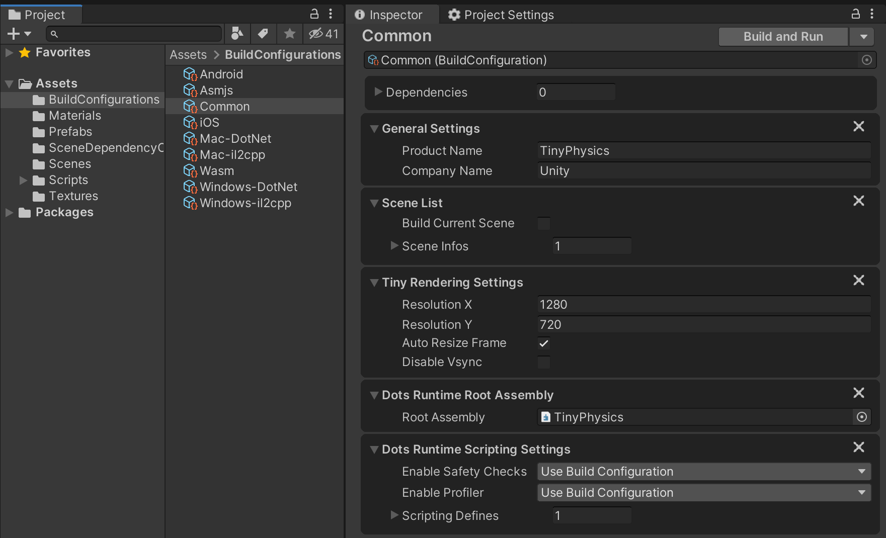

For example, here you can see the Android build configuration depending on
“Common”, with inherited settings greyed out:  


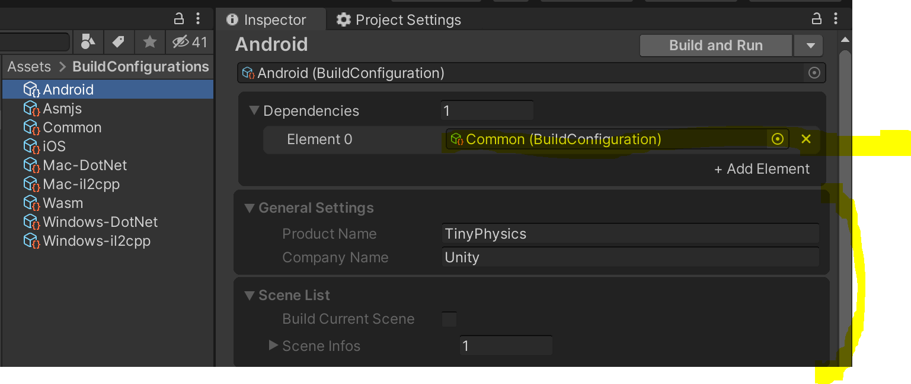

When ready to test, select a Build Configuration, we recommend using the DotNet
one for faster iteration:

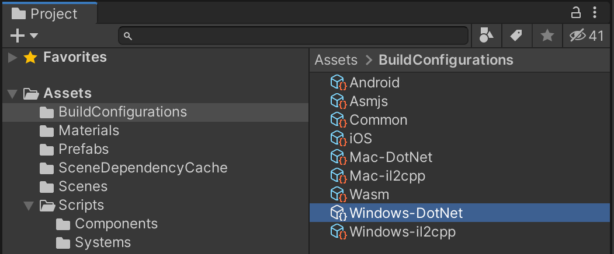

And use Build & Run option in the inspector:  


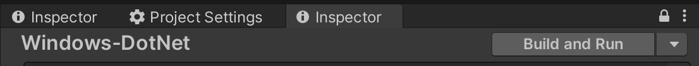

You should see this:
<https://drive.google.com/file/d/1yc7jXCD2vOhRPJwxl9WOUuN1kE3tbgCE/view?usp=sharing>

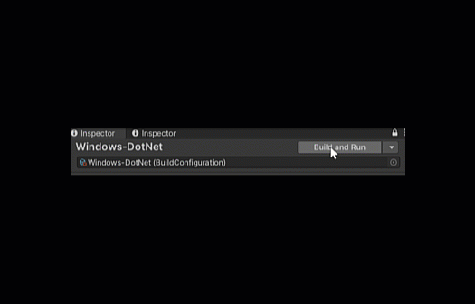

## 2. Simple Physics

Now that we have a world, we can start making objects that are controlled by the
new Unity Physics package which offers a deterministic rigid body dynamics
system and spatial query system based on data oriented tech stack (DOTS). Full
documentation is available here:

<https://docs.unity3d.com/Packages/com.unity.physics@0.3/manual/index.html>

-   Add a PhysicsShape component to all elements that need to be used by the
    physics engine.  
    

    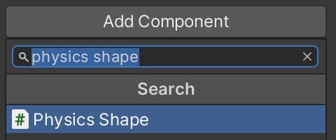

-   Make sure to select the correct Shape Type that matches your mesh.  
    

    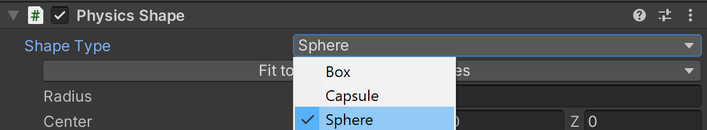

-   Add a PhysicsBody component (somewhat similar to UnityEngine.Rigidbody) to
    your character.  
    

    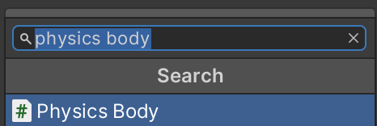

-   Make sure to remove any Collider like

    

    added by default to any 3D object created.

-   Building will show you how physics animates dynamic objects

-   Now it’s time to experiment with the various PhysicsShape and PhysicsBody
    parameters.

    -   **Mass** of the spheres

    -   **Restitution** (bounciness) of the spheres

    -   **Friction** of the ramps

    -   **Kinematic Motion Type** of the cubes, and added **Initial Angular
        Velocity** of the fan so that it will spin

    -   **Center of Mass** of the capsules  
        

        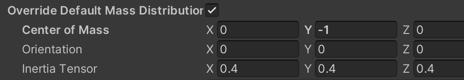

    -   **Inertia Tensor** of the character to define rotation around each axis

Note that the **Physics Body** and **Physics Shape** view that you have in the
Editor is actually composed of multiple data components under the hood at
runtime, see [Physics Body data
documentation](https://docs.unity3d.com/Packages/com.unity.physics@0.3/manual/getting_started.html#physics-body-data).

Running scene “2. Simple Physics” should look like this:

<https://drive.google.com/open?id=1u7kpvoLu_YRF7f8S-mc7CvZPu1QDmxyt>

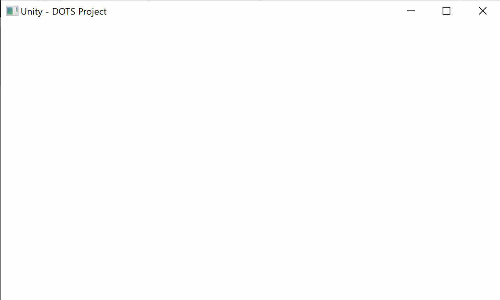

## 3. Movement

In this section we will start adding code (Components & Systems) to control the
Character and other elements of the scene. Keep in mind that Project Tiny
runtime is different from the regular Unity and to Build & Debug your project
you need a separate DOTS C\# Solution from the regular Unity solution. You’ll
need to generate and open the solution via **Assets** \> **Generate DOTS C\#
Solution**.

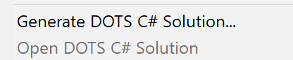

See [DOTS C\#
Solution](https://docs.google.com/document/d/1A8hen2hLFY5FLkC5gd3JP2Z-IpHfnAX-CpYLK3aOdwA/edit#heading=h.flt05qfyo528)
section of the Getting Started for more details.

Remember that if you double click on a script (.CS file) it will open the
regular Unity solution/project not the DOTS one, and while it’s OK to simply
edit code, you won’t have the proper context (intellisense, assembly references,
etc) if you do that.

Now let’s move our character by applying force to its physics velocity
component.

-   Create a Moveable component that will contain the force to be applied to
    move the object and the direction of movement:
```cs
[GenerateAuthoringComponent]
public struct Moveable : IComponentData
{
   public float moveForce;
   public float3 moveDirection;
}
```
-   Create a MovementSystem that will apply the force to all entities that
    contain Moveable components as well as physics components:
```cs
public class MovementSystem : SystemBase
{
   protected override void OnUpdate()
   {
   float deltaTime = Time.DeltaTime;
   Entities.ForEach((ref Moveable moveable, ref PhysicsVelocity velocity, ref
   PhysicsMass mass, ref Rotation rotation, ref LocalToWorld localToWorld) =\>
   {
   if (moveable.moveDirection.x != 0 \|\| moveable.moveDirection.z != 0)
   {
   // Move by applying a force
   velocity.ApplyLinearImpulse(mass, moveable.moveDirection \*
   moveable.moveForce \* deltaTime);
   // Look where you're going
   rotation.Value = quaternion.LookRotation(moveable.moveDirection,
   localToWorld.Up);
   }
   }).ScheduleParallel();
   }
}
```
-   Add the Moveable component to the character and set its force and direction:  
    

    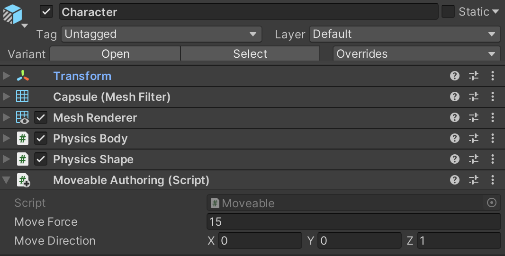

-   Build to see the character move in the specified direction (Z axis for
    example).

*NOTES ON USING IMPULSE:*

Impulse and Force take into account the body's mass. Velocity and Acceleration
don't.

Impulse and Velocity are an instant change. Force and Acceleration are over
time.
```cs
//To set velocity directly:
   ApplyLinearImpulse((targetVelocity - currentVelocity) / invMass)
   physicsVelocity.Linear = targetVel

//To apply acceleration:
   ApplyLinearImpulse((acceleration / invMass) \* deltaTime)
   physicsVelocity.Linear += acceleration \* deltaTime

//To add impulse:
   ApplyLinearImpulse(addedImpulse)
   physicsVelocity.Linear += (addedImpulse \* invMass)

//To apply force:
   ApplyLinearImpulse(force \* deltaTime)
   physicsVelocity.Linear += (force \* invMass) \* deltaTime
```
## 4. Keyboard Input

Let’s start controlling the move direction of our character using the keyboard.

-   Jumping is fun so let’s add a Jumper component to our character and a
    JumpSystem like we did for the movement.  
```cs    
    [GenerateAuthoringComponent]
public struct Jumper : IComponentData
{
public float jumpImpulse;
public bool JumpTrigger { get; set; }
}
```

>   Note the JumpTrigger bool will be set in code.

-   Create a MoveWithKeyboardSystem system tasked with listening to key presses
    and modifying the Moveable and Jumper components of our character.  
    Note that MoveWithKeyboardSystem needs to run before the MovementSystem, so
    the declaration looks like this:  
    ```cs
    [UpdateBefore(typeof(MovementSystem))]  
    public class MoveWithKeyboardSystem : SystemBase  
    {...}
    ```

-   Since we only want to move our character, we need to attach a
    MoveWithKeyboard component tag used by our MoveWithKeyboardSystem to
    identify which entities to process: 
    ```cs
    [GenerateAuthoringComponent]  
    public struct MoveWithKeyboard : IComponentData  
    {}
    ```

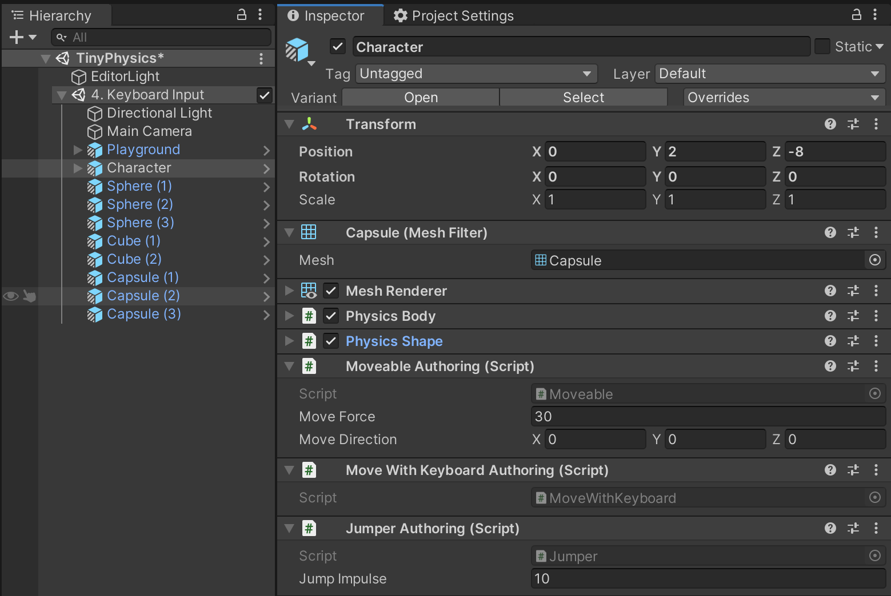

-   Build and use WASD keys to move and Space to jump

## 5. Tap, Drag and Swipe

Pointer interactions are crucial to all mobile games so here we’ll look at some
common uses.

-   The first steps involve catching input from touch or mouse and raycasting
    from screen to world in order to detect what is under the pointer. We have
    created the abstract class PointerSystemBase as a starting point for any
    other system that requires pointer inputs. PointerSystemBase will capture
    touch events from Unity.Tiny.Input.InputSystem and call the corresponding
    abstract methods (OnInput\*), which are then implemented in the
    Tap/Drag/Swipe systems so each type of input motion can be processed.  
    Overall our Pointer systems look like this:

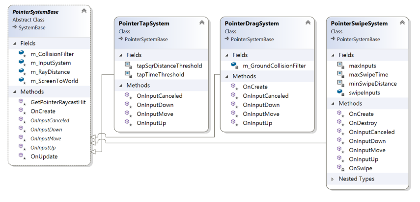

-   The PointerSystemBase system also defines the GetPointerRaycastHit method to
    determine which object was pointed at.

-   The GetPointerRaycastHit method uses a CollisionFilter which is used with
    raycasting in order to filter what objects we’re interested in. See [Unity
    Physics Filtering
    documentation](https://docs.unity3d.com/Packages/com.unity.physics@0.3/manual/collision_queries.html#filtering).
    In this sample all objects have been revised so they belong to their
    appropriate category.

    -   Category names are defined in Assets/PhysicsCategoryNames:


-   And each object has filter assigned to PhysicsShape components in Editor:  
    

    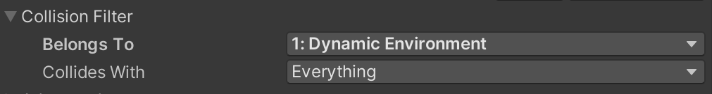

### 5.1 Tap

Let’s make those 3 spheres jump when tapped

-   We need a Tappable component that stores tap data which can be attached to
    all entities listening for tap. In our example an interaction is considered
    a tap if the down and up motion is quick and the pointer doesn’t move too
    much so we need to keep track of time and distance. Values for associates
    constants are defined in PointerTapSystem

-   The PointerTapSystem’s job is to detect taps on objects and set the IsTapped
    flag in the Tappable component.

-   With this we can create a JumpWithTapSystem that makes our spheres jump when
    tapped. We just need to add the following to spheres:

    -   a Jumper component to define the impulse,

    -   a Tappable component to indicate that it can be tapped and to store tap
        data

    -   a JumpWithTap component used by this system to make the connection
        between tap and jump.

-   Because of the different mass and restitution parameters we set, the
    behaviour will be very different per sphere.

<https://drive.google.com/open?id=1BEGDsmJXE3UW7arB9FNHtOdy-ZAXwkXs>

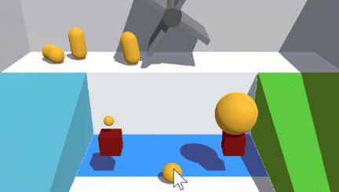

### 5.2 Drag

Let’s use the pointer to move the 2 kinematic cubes around.

-   Like for the tap system we need to create a Draggable component attached to
    objects we want to be able to drag.  
    

    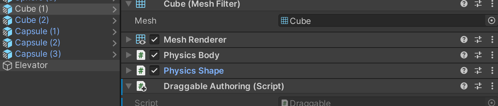

-   From the PointerSystemBase class again we made the PointerDragSystem which
    identifies draggable objects and moves them along the Floor of the scene.

-   Floor is marked as Belong to Ground & Static (from
    Assets/PhysicsCategoryNames).

### 5.3 Swipe

We want to be able to detect a swipe up/down in order to make an elevator go up
and down.

-   First step is to create a Swipeable component that will hold information
    about the swipe.

-   Then a PointerSwipeSystem that tracks gestures in order to convert them to
    swipes and modify the Swipeable component of all entities.

    -   We are only detecting up, down, left and right swipes but we could
        easily extend this to pass the actual swipe direction vector instead.

    -   Also we are updating all entities that have a Swipeable component, but
        we could easily modify it to only change the entities that were touched
        by the pointer

For the elevator we need an Elevator component to define the positions, speed
and state:
```cs
[GenerateAuthoringComponent]
public struct Elevator : IComponentData
{
public float loweredPosition;
public float raisedPosition;
public float moveSpeed;
public ElevatorState ElevatorState { get; set; }
}
```

-   And the ElevatorSystem that sets the velocity of the elevator and stops it
    when it reaches its destination

-   Finally an ElevatorSwipeControlSystem that handles the interaction between
    the Swipeable component and the Elevator component.

<https://drive.google.com/open?id=1eba-FJOnV2aEgUTI9MdYrdeeWeJsvlz9>

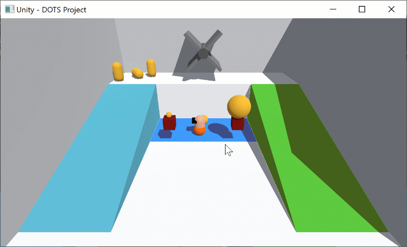

## 6. Virtual Joystick

We need to be able to control our character on mobile without keys, so we’ll
need to make a virtual joystick. Since at this time UI is not available in
Project Tiny we use meshes with a PhysicsShape component that can be raycasted
in order to detect pointer events.

-   Create the virtual joystick using meshes and set its CollisionFilter
    category to UI.

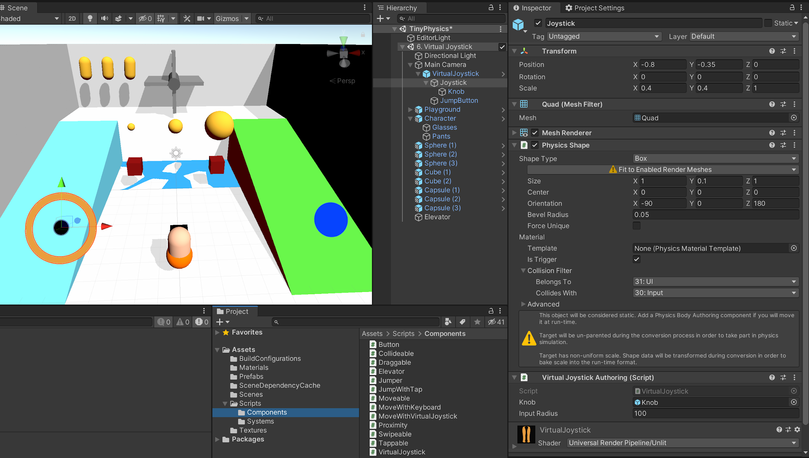

-   Create the VirtualJoystick component that contains information about its
    state:
```cs
[GenerateAuthoringComponent]
public struct VirtualJoystick : IComponentData
{
public Entity knob;
public float inputRadius;
public bool IsPressed { get; set; }
public int PointerId { get; set; }
public float2 Center { get; set; }
public float2 Value { get; set; }
}
```
-   Create the VirtualJoystickSystem where we can detect if the virtual joystick
    is pressed and calculate the distance from its center in order to set the
    VirtualJoystick component.

-   Leveraging the tap system we can create a button.

-   Finally we need a MoveWithVirtualJoystickSystem that links a virtual
    joystick to the movement system and the virtual button to the jump system.
    You also need to add the MoveWithVirtualJoystick component to the Character.

## 7. Advanced raycasting

In order to calculate distances and predict collisions we need to use physics
queries.

### 7.1 Proximity detection

The goal is to use physics distance queries to open and close a door when the
player is near.

-   We have a simple system that calculates the distance between entities with
    the Proximity component and the closest entity that it can collide with.

-   The ElevatorProximitySystem uses the proximity information to toggle states
    of the Elevator component attached to the same entity. This system is pretty
    much identical to the ElevatorSwipeControlSystem but instead of reading the
    Swipeable component it uses the Proximity component to update the Elevator
    component.

### 7.2 Collision detection

The goal here is to change the color of a button when the player touches it.

-   The Collideable component will store information about the entity it
    collided with

-   The CollisionSystem will run a job that inherits from
    Unity.Physics.ICollisionEventsJob. It’s a special job that receives a
    CollisionEvent which contains information about the colliding entities. We
    then check if the entities contain our Collideable component and update it
    with the entity it collided with. Make sure that the option **Raises
    Collision Events** is checked in the **Advanced** section of the
    **PhysicsShape** component**.**

-   Now we can use the ButtonCollisionSystem to change the material color of our
    Button when it collides with something. We know it’s the player since we set
    its PhysicsShape CollisionFilter to only collide with the Character, but we
    could change the behaviour depending on what it collided with.
